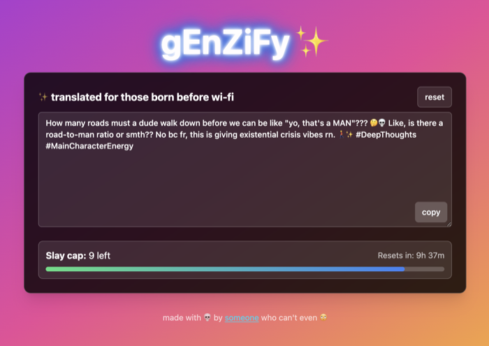
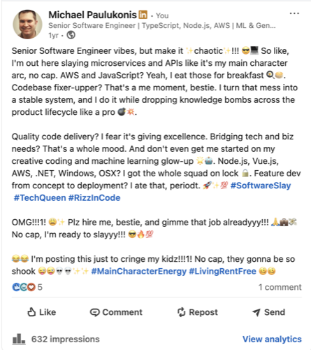

# gEnZiFy ✨

A web app that translates your boring, normal text into chaotic, hyper-online Gen-Z slang and emoji brain-rot. Built primarily with [Vercel v0](https://v0.dev). My kids hate it, so it must be doing something right.

**Live:** [v0-genzify.vercel.app](https://v0-genzify.vercel.app/)



## What it does

Paste in any text, pick an emoji level (off / on / insane), hit **gEn-Z-iFy!!1!**, and get back a chaotic slang-ified rewrite - complete with "no cap", "rizz", ironic misspellings, and unhinged capitalization. Translations are powered by OpenAI (`gpt-4o`) via the Vercel AI SDK.

Usage is capped client-side at 10 requests per 12-hour period per browser fingerprint.

## In the wild

Used it to genzify my own professional summary and posted it to LinkedIn as a joke - 632 impressions, kids appropriately mortified.



[See the original post](https://www.linkedin.com/posts/michaelpaulukonis_softwareslay-techqueen-rizzincode-activity-7326638267938840577-em67?utm_source=share&utm_medium=member_desktop&rcm=ACoAAACNmjYBPvVy6txkADc8iT4m870sZd331_4)

## Development

Package manager is **pnpm**.

```bash
pnpm install
pnpm dev      # http://localhost:3000
pnpm build
pnpm start
pnpm lint
```

You'll need an `OPENAI_API_KEY` in your environment for the conversion feature to work.

## Stack

Next.js (App Router), TypeScript, Tailwind CSS, shadcn/ui, Vercel AI SDK, deployed on Vercel.

See [CLAUDE.md](./CLAUDE.md) for architecture notes.
